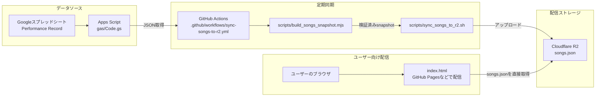

# uni-uta-db

公開ページ: https://<your-github-user>.github.io/uni-uta-db/

**Cloudflare R2 + Static Assets** 構成です。  
このリポジトリでは、`Performance Record` シートをGASでJSON化し、GitHub ActionsでR2へ定期同期する運用を想定しています。

## 構成

- `gas/Code.gs`: スプレッドシートを `songs.json` 形式で返すGASコード
- `.github/workflows/sync-songs-to-r2.yml`: GAS -> R2 定期同期
- `scripts/build_songs_snapshot.mjs`: GAS取得・データ契約検証・スナップショット生成
- `scripts/sync_songs_to_r2.sh`: R2への差分アップロード・読み戻し検証
- `index.html`: 楽曲検索UI
- `src/data/songsApi.js`: R2取得・検証・キャッシュ制御
- `src/domain/songCatalog.js`: 楽曲の分類・検索・並び替え・リンク正規化
- `src/features/danmaku.js`: カスタム弾幕のUnicode処理・生成・期限付きキャッシュ
- `src/features/scrollBubbles.js`: 泡演出の強度・個数・DOM生成
- `src/platform/*.js`: PWAとクリップボードのブラウザ依存処理
- `src/ui/mobileEffects.js`: モバイル限定の水紋・コピー反応・スケルトン・スクロール進捗
- `src/ui/renderSongs.js`: 楽曲カード描画・安全な検索語ハイライト
- `src/ui/swipeTrack.js`: 上下フォームのスワイプ制御
- `src/utils/scheduling.js`: 検索デバウンス・描画フレーム制御
- `sw.js`: 同一オリジンのアプリシェル用Service Worker
- `tests/*.test.js`: データ契約・取得処理・楽曲ドメインのユニットテスト（Vitest）
- `.github/workflows/pr-test.yml`: PR時の自動テスト


### PR時の自動テスト（新規）

このリポジトリには、`pull_request`と手動実行で構文・Service Worker参照・全テストを検証するワークフロー（`.github/workflows/pr-test.yml`）があります。

ローカル実行手順:

```bash
npm ci
npm run verify
```

---

## Worker について

このリポジトリの実運用は **Worker非依存（R2直接参照）** です。

- `index.html` は R2 の `songs.json` を直接 `fetch` します。
- データ更新は GitHub Actions（GAS → R2）で完結します。

そのため、Worker エントリ（`wrangler.toml` / `src/worker.js`）は運用上必須ではありません。

---

## 全体構成図



- **通常経路**: `スプレッドシート → GAS → GitHub Actions → R2 → index.html(ブラウザ)`

---

## 1. GAS（スプレッドシート読み出し）

対象シート名: `Performance Record`

- ヘッダー行: 3行目
- データ開始行: 4行目

列は以下を前提にしています。

- A: アーティスト名
- B: 曲名
- C: 備考（歌ってみた/ショート情報 + URL可）
- D: 歌枠直リンク（タイトル + URL、または8桁日付のみ）
- E: 出典元情報
- F: 掲載チェック

`掲載チェック` が有効（✅ / ☑ / TRUE / 1 など）の行だけを出力します。

- チェック済み行はA/B必須です。
- A+Bの重複、存在しない8桁日付、HTTP(S)以外のURLは同期前に拒否します。
- 種別優先度は `歌ってみた > 歌枠 > ショート` です。
- Webアプリ用スプレッドシートIDはApps ScriptのScript Propertiesに`SPREADSHEET_ID`として設定できます。未設定時は互換用IDを使用します。

### Performance Record整理スクリプト

`sheet_scripts/performance_record.gs` はA+Bが同じ楽曲を次の規則で1行に整理します。

- `歌ってみた > 歌枠 > ショート` のカテゴリ優先
- 同カテゴリ内はD列文頭の日付が新しい行を優先
- 下位行はすべて `履歴` シートへ移動
- 残す行に不足しているE列と、有効なF列の掲載チェックを下位行から継承
- A/Bが揃った新規行でF列が空なら `TRUE` を既定設定
- 整理後は行全体をB列昇順、A列昇順、D列降順で並べ替え

詳細は [`docs/performance_record_gs_translation_ja.md`](docs/performance_record_gs_translation_ja.md) を参照してください。

### GASデプロイ手順

1. スプレッドシートで Apps Script を開く
2. `gas/Code.gs` と `sheet_scripts/performance_record.gs` の内容を配置
3. プロジェクトの設定 > スクリプト プロパティで`SPREADSHEET_ID`を設定
4. デプロイ > 新しいデプロイ > ウェブアプリ
   - 実行ユーザー: 自分
   - アクセス権: リンクを知っている全員
5. 発行されたURLに `?api=songs` をつけ、`items`と`total`を確認

例:

```text
https://script.google.com/macros/s/AKfycbyR0J5IjXT7lZjDT7SAIkM4TW8SP1k0iNy3wW0Q2YhIGON6ugsvdffm0zYI1cJzgIoP/exec?api=songs
```

---

## 2. GitHub Actions（GAS -> R2 同期）

ワークフロー: `.github/workflows/sync-songs-to-r2.yml`

- 手動実行: `workflow_dispatch`
- 同期基盤更新時: `main`へのpush（ワークフロー、GAS、スナップショット生成・R2同期スクリプトの変更時のみ）
- 定期実行: 毎日 JST 12:00（UTC 03:00）
- 注記: GitHub Actions の cron は UTC 表記です。
- 同じ内容の再アップロードは `dataVersion` 比較で省略します。
- GAS取得とR2アップロードは再試行し、アップロード後に同一内容を読み戻して検証します。

### Branch protection / Rulesets の必須チェック名を更新する

`main` に対して古い必須チェック（例: `R2worker`）が残っていると、PR が常にブロックされます。  
以下の手順で、現在の workflow/job 名に合わせて更新してください。

1. GitHub の対象リポジトリで、次のいずれかを開く
   - `Settings > Branches`（Branch protection rules）
   - `Settings > Rules > Rulesets`
2. `main` に適用されているルールを編集する。
3. `Require status checks to pass before merging` の一覧から、旧チェック名（`R2worker` など）を削除する。
4. 現行ワークフローに対応するチェックを追加する。
   - Workflow 名: `Sync songs.json to Cloudflare R2`
   - Job 名: `sync`
   - 目安: チェック名は通常 `Sync songs.json to Cloudflare R2 / sync` の形式で表示されます。
5. 保存後、PR を再実行して Required checks が上記チェックのみになっていることを確認する。

### 必要な GitHub Secrets

- `GAS_SONGS_API_URL`（未設定時は以下のURLを使用）
  - `https://script.google.com/macros/s/AKfycbyR0J5IjXT7lZjDT7SAIkM4TW8SP1k0iNy3wW0Q2YhIGON6ugsvdffm0zYI1cJzgIoP/exec?api=songs`
- `R2_ACCOUNT_ID`
- `R2_ACCESS_KEY_ID`
- `R2_SECRET_ACCESS_KEY`
- `R2_BUCKET`
- `R2_OBJECT_KEY`（通常 `songs.json`）


### R2アップロード/読み取りを個別検証する（切り分け用）

`sync` ワークフローとは別に、アップロード可否と読み取り可否を分けて確認したい場合は次を実行します。

```bash
chmod +x scripts/verify_r2_upload_and_read.sh
R2_ENDPOINT_URL="https://<ACCOUNT_ID>.r2.cloudflarestorage.com" \
R2_BUCKET="<bucket>" \
R2_OBJECT_KEY="songs.json" \
AWS_ACCESS_KEY_ID="<access_key>" \
AWS_SECRET_ACCESS_KEY="<secret_key>" \
bash scripts/verify_r2_upload_and_read.sh
```

このスクリプトは以下を順に検証します。

1. GASレスポンスがデータ契約を満たすか（項目型・日付・URL・件数を含む）
2. R2へアップロードできるか（検証用キーへ保存）
3. R2から同一内容を読み戻せるか（S3 API経由）
4. （廃止）`WORKER_BASE_URL` を使ったWorker読み取り検証

検証で作成したオブジェクト（`*.verify.<timestamp>.json`）は、終了時に自動削除されます（失敗時も削除を試行）。
削除に失敗した場合は warning のみ表示し、検証本体の成功/失敗結果はそのまま維持されます。

※ `WORKER_BASE_URL` を使った検証は廃止済みです。指定しなければ通常のR2検証のみ実行されます。

### トラブルシュート（Workflow失敗時）

- `Missing credentials` エラー
  - `R2_ACCESS_KEY_ID` / `R2_SECRET_ACCESS_KEY`（または `AWS_ACCESS_KEY_ID` / `AWS_SECRET_ACCESS_KEY`）を設定。
- `Missing required R2 config` エラー
  - `R2_ACCOUNT_ID`, `R2_BUCKET`, `R2_OBJECT_KEY` を設定。
- `GAS response is invalid JSON` / `GAS response is not a JSON object` エラー
  - JSONの形式不正だけでなく、**GASがHTMLエラーページを返している**場合にも起こります。
  - まず `GAS_SONGS_API_URL` をブラウザで開き、`{` から始まるJSONが返るかを確認してください（`?api=songs` を必ず付与）。
  - `scripts/build_songs_snapshot.mjs` は項目型・日付・URL・件数も検証します。エラーになった項目をスプレッドシート側で確認してください。
- `GAS API error: ...` エラー
  - GASが重複、必須値欠損、日付不正などをJSONで報告しています。メッセージに含まれる行番号をスプレッドシートで修正してください。

---

## リポジトリ譲渡（移設）時のチェックリスト

このアプリは、設定値をSecrets / `index.html` に分離しているため、譲渡時は次だけ差し替えれば継続開発できます。

1. GitHubでリポジトリを移設/rename
   - 例: `uni-uta-db`
2. GitHub Secretsを新しいリポジトリへ再設定
   - `R2_ACCOUNT_ID`, `R2_ACCESS_KEY_ID`, `R2_SECRET_ACCESS_KEY`, `R2_BUCKET`, `R2_OBJECT_KEY`, `GAS_SONGS_API_URL`
3. `index.html` の `meta[name="songs-r2-json-url"]` を新しいR2公開URLへ変更
4. Actionsの手動実行（`workflow_dispatch`）で `songs.json` 同期を確認
5. GitHub Pages URLで表示・検索・コピーの動作確認

> GitHub上の譲渡自体は、対象リポジトリの **Settings > General > Transfer ownership** から実施できます。
> 移設先アカウントに権限がある状態で、上記チェックリストを順に実施するとスムーズです。

- フロントで `サーバー: エラー:HTTP 404` が出る
  - `index.html` の `meta[name="songs-r2-json-url"]` に、R2公開URL（例: `https://pub-xxxxxxxxxxxxxxxxxxxxxxxxxxxxxxxx.r2.dev/songs.json`）を設定してください。
  - もしくはブラウザで `localStorage.setItem("songs_r2_json_url", "https://pub-xxxxxxxxxxxxxxxxxxxxxxxxxxxxxxxx.r2.dev/songs.json")` を実行して再読込してください。
  - 複数候補を持たせる場合は `meta[name="songs-r2-fallbacks"]` にカンマ区切りでURLを設定できます。
  - CORSで失敗する場合は、R2側の公開/CORS設定を見直してください。

- エラーログに `{ "errorName": "Error", "statusCode": "404", "statusDescription": "通信エラー" }` が出る
  - フロントは候補URLを順に試し、**すべて404のとき**この表示になります（`songs-r2-json-url` → `songs-r2-fallbacks` の順）。
  - まずブラウザで `https://pub-...r2.dev/songs.json` を直接開き、404にならないか確認してください。
  - 404の場合は、`R2_BUCKET` / `R2_OBJECT_KEY`（通常 `songs.json`）にアップロードされているか、Actionsの最新実行が成功しているかを確認してください。
  - GitHub Pages運用では、まず `meta[name="songs-r2-json-url"]` に有効なR2公開URLを設定してください。

---

## 3. R2に保存するJSONスキーマ

```json
{
  "items": [
    {
      "title": "曲名",
      "artist": "アーティスト名",
      "kind": "live",
      "memo": "備考",
      "singingTag": "備考",
      "liveLink": "https://...",
      "liveTitle": "配信タイトル",
      "lastSungDate": "2025-01-20",
      "publishedAt": "2025-01-20"
    }
  ],
  "total": 1,
  "generatedAt": "2026-01-01T00:00:00.000Z",
  "schemaVersion": 1,
  "dataVersion": "sha256:..."
}
```

補足:
- `lastSungDate`: 歌枠直リンクの先頭8桁 (`yyyymmdd`) から生成
- `publishedAt`: ソート・表示の基準日（`lastSungDate` と同じ日付を格納）
- `dataVersion`: `schemaVersion` と `items` の内容から生成するSHA-256。生成日時だけが変わっても同じ値になります。
- `artist` と `title` の組み合わせは一意である必要があります。重複時は自動で優先順位を決めず、同期を停止してスプレッドシート側の修正を求めます。

### ブラウザ側の安定化

- R2取得は候補ごとに15秒で中断し、ネットワークエラー・404・408・429・5xxでは次候補を試します。
- ETagがCORSで公開されない場合も検証済みJSONをlocalStorageへ保存します。
- 通信失敗時は期限内または既存の検証済みキャッシュを表示し続けます。
- Service Workerは同一オリジンのHTML/JS/アイコンだけを保持し、R2の`songs.json`には介入しません。

---

## 4. 動作確認

- フロント: `index.html` からR2公開URLの `songs.json` を直接取得

フロントは `songs.json` が「配列形式」「{ items: [] } 形式」の両方を受け取れます。

